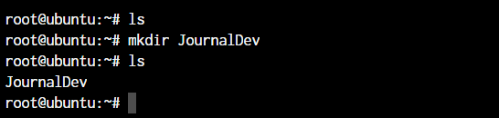
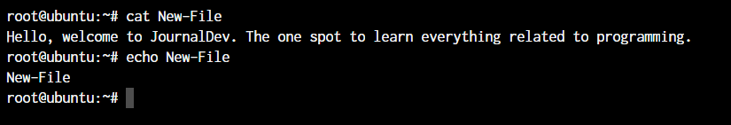

1. [**ls** - The most frequently used command in linux to list directories](image/ls-command-default.png)
1. [**pwd** - Print working directory command in linux](image/pwd-default-output.png)
1. [**cd** - Linux command to navigate through directories](image/cd-command-default.png)
1. [**mkdir** - Command used to create directories in linux](image/mkdir-default.png)
1. [**mv** - Move or rename files in Linux](image/mv-command-default.png)
1. [**cp** - Similar usage as mv but copying files in Linux](image/cp-command-default.png)
1. [**rm** - Delete files or directories](image/rm-default.png)
1. [**touch** - Create blank/empty files](image/touch-command-default.png)
1. [**ln** - Create symbolic links (shortcuts) to other files](image/symbolic-link-default.png)
1. **clear** - Clear terminal display
1. [**cat** - Display file contents on the terminal](image/cat-and-echo-commands.png)
1. **echo** - Print any text that follows the command
1. **less** - Linux command to display paged outputs in the terminal
1. **man** - Access manual pages for all linux commands
1. [**uname** - Linux command to get basic information about the outputs](image/uname-and-whoami-commands.png)
1. **whoami** - Get the active username
1. [**tar** - Command to extract and compress files in linux](image/tar-basic-usage.png)
1. [**grep** - Search for a string within an outputs](image/grep-command-example.png)
1. [**head** - Return the specified number of lines from the top](image/head-command.png)
1. [**tail** - Return the specified number of lines from the bottom](image/tail-command.png)
1. [**diff** - Find the difference between two files](image/diff-command.png)
1. [**cmp** - Allows you to check if two files are identical](image/cmp-command.png)
1. [**comm** - Combines the functionality of diff and cmp](image/comm-command.png)
1. **sort** - Linux command to sort the content of a file while outputting
1. [**export** - Export environment variables in Linux](image/export-environment-variables.png)
1. **zip** - Zip files in Linux
1. **unzip** - Unzip files in Linux
1. **ssh** - Secure Shell command in Linux
1. [**service** - Linux command to start and stop services](image/service-command.png)
1. [**ps** - Display active processes](image/ps-command.png)
1. [**Kill and Killall** - Kill active processes by process ID or name](image/kill-command.png)
1. [**df** - Display disk filesystem information](image/df-command.png)
1. **mount** - Mount file systems in Linux
1. [**chmod** - Command to change file permissions](image/chmod-command.png)
1. [**chown** - Command for granting ownership of files or folders](image/chown-command.png)
1. [**ifconfig** - Display network interface and IP addresses](image/ifconfig-command.png)
1. [**traceroute** - Trace all the network interfaces and IP addresses hops to reach the destination](image/traceroute-command.png)
1. **wget** - Direct download files from the internet
1. **ufw** - Firewall command
1. **iptables** - Base firewall for all other firewall utilities to interface with
1. **apt, pacman, yum, rpm** -- Package managers depending on the distribution
1. **sudo** - Command to escalate privileges in Linux
1. [**cal** - View a command-line calendar](image/cal-command-output.png)
1. **alias** - Create custom shortcuts for your regularly used commands
1. **dd** - Major;y used for creating bootable USB sticks
1. **whereis** - Locate the binary, source, and manual pages for a command
1. **whatis** - Find what a command is used for
1. [**top** - View active processes live with their system usage](image/top-command-output.png)
1. **useradd and usermod** - Add a new user or change existing user data
1. [**passwd** - Create or update passwords for existing users](image/passwd-command.png)

---
## The ```ls``` command in Linux


---
## The ```pwd``` command in Linux


Now, your terminal prompt should usually have the complete directory anyway. But in case it doesn’t, this can be a quick command to see the directory that you’re in. Another application of this command is when creating scripts where this command can allow us to find the directory where the script has been saved.

---
## The ```cd``` command in Linux
While working within the terminal, moving around within directories is pretty much a necessity. The cd command is one of the important Linux commands you must know, and it will help you navigate through directories. Just type ``cd`` followed by directory, as shown below.
```
root@ubuntu:~# cd <directory path>
```


---
## The ```mkdir``` command in Linux
```
root@ubuntu:~# mkdir <folder name>
```



---
## The ```cp``` and ```mv``` commands
The ``cp`` and ``mv`` commands are equivalent to the copy-paste and cut-paste commands in Windows. But since Linux doesn’t really have a command for renaming files, we also use the ``mv`` command to rename files and folders
```
root@ubuntu:~# cp <source> <destination>
```


In the above command, we created a copy of the file named Sample. Let's see what happens if we use the ``mv`` command in the same manner.

```
root@ubuntu:~# mv <source> <destination>
```


In the above case, since we were moving the file within the same directory, it acted as a rename. The file name is now changed.

---
## The ```rm``` command in Linux
In the previous section, we deleted the Sample-Copy file. The rm command is used to delete files and folders and is one of the important Linux commands you must know.

```
root@ubuntu:~# rm <file name>
```


To delete a directory, you must add the ``-r`` argument to it. Without the ``-r`` argument, the ``rm`` command won't delete directories.

```
root@ubuntu:~# rm -r <folder/directory name>
```
The -r flag in the ``rm`` command in Linux stands for **“recursive”**. When used with the ``rm`` command, it will remove not only the specified file but also all of its subdirectories and the files within those subdirectories recursively.

Note: It’s important to be careful when using the ``rm`` command with the ``-r`` flag, as it can quickly and permanently delete a large number of files and directories. It’s a good idea to use the ``-i`` flag in conjunction with the ``-r`` flag, which will prompt you for confirmation before deleting each file and directory.

For example, to remove the ``mydir`` directory and its contents with confirmation, you can use this command:

```
root@ubuntu:~# rm -ri mydir
```
This will prompt you for confirmation before deleting each file and directory within the ``mydir`` directory.

---
## The ```touch``` command in Linux
The ``touch`` command in Linux creates an empty file or updates the timestamp of an existing file.

```
root@ubuntu:~# touch <file name>
```


---
## The ```ln``` command in Linux
To create a link to another file, we use the ln command. This is one of the most important Linux commands that you should know if you’re planning to work as a Linux administrator.

```
root@ubuntu:~# ln -5 <source path> <link name>
```


The ``-s`` flag creates a symbolic link (also known as a symlink or soft link) to a file or directory. A symbolic link is a special type of file that acts as a shortcut or pointer to another file or directory.

By default, the ``ln`` command will make hard links instead of symbolic or soft links.

**Note**: Say you have a text file. If you make a **symbolic link** to that file, the link is only a pointer to the original file. If you delete the original file, the link will be broken, as it no longer has anything to point to.

A **hard link** is a mirror copy of an original file with the exact same contents. Like symbolic links, if you edit the contents of the original file, those changes will be reflected in the hard link. If you delete the original file, though, the hard link will still work, and you can view and edit it as you would a normal copy of the original file.

---
## The ```clear``` command in Linux
The ``clear`` command in Linux clears the terminal screen. It removes all the text and output currently displayed on the terminal and gives you a clean slate to work with.

Here is an example of how to use the ``clear`` command:

```
root@ubuntu:~# clear
```
This will list the files and directories in the current directory, and then clear the terminal screen.

**Note:** The ``clear`` command does not delete any files or data from your system. It only affects the display of the terminal.

---
## The ```cat```, ```echo```, and ```less``` commands
When you want to output the contents of a file or print anything to the terminal output, we use the ``cat`` or ``echo`` commands. Let’s see their basic usage.
```
root@ubuntu:~# cat <file name>
root@ubuntu:~# echo <Text to print on terminal>
```



As you can see in the above example, the ``cat`` command, when used on our ``New-File``, prints the contents of the file. At the same time, when we use ``echo`` command, it simply prints whatever follows after the command.

The ``less`` command is used when the output printed by any command is larger than the screen space and needs scrolling. The ``less`` command allows the user to break down the output and scroll through it with the use of the enter or space keys.

The simple way to do this is with the use of the pipe operator (``|``).

```
root@ubuntu:~# cat /boot/grub/grub.cfg | less
```
Note: Use the ``-S`` flag with ``less`` to enable line wrapping. This will allow you to view long lines of text without scrolling horizontally.

Use the ``-N`` flag with ``less`` to display line numbers. This can be useful when you need to know the line number of a specific piece of text.

You can use these useful flags in the following way:
```
root@ubuntu:~# cat /boot/grub/grub.cfg | less -sn
```
Using ``less`` with the pipe operator can be useful in many different situations. Here are a few examples:

Viewing the output of a long-running command, such as ``top`` or ``htop``.
Searching for specific text in the output of a command, such as ``grep`` or ``cat``.

---
## The ```man``` command in Linux
The ``man`` command is a very useful Linux command one must know. When working with Linux, the packages that we download can have a lot of functionality. Knowing it all is impossible.

The ``man`` command in Linux is used to display the manual page for a specific command. It provides detailed information about the command, including its syntax, options, and examples.

Here’s an example of how to use the ``man`` command:

Open a terminal and type ``man ls`` to display the manual page for the ``ls`` command.

```
root@ubuntu:~# man ls
```

This will display a page that looks something like this:
```
OutputLS(1)                            User Commands                           LS(1)

NAME
       ls - list directory contents

SYNOPSIS
       ls [OPTION]... [FILE]...

DESCRIPTION
       List information about the FILEs (the current directory by default).

       Sort entries alphabetically if none of -cftuvSUX nor --sort is specified.

       Mandatory arguments to long options are mandatory for short options too.

       -a, --all
              do not ignore entries starting with .

       -A, --almost-all
              do not list implied . and ..

       -c     with -lt: sort by, and show, ctime (time of last modification
              of file status information) with -l: show ctime and sort
              by name; 
```

---
## The ```uname``` and ```whoami`` commands
The ``uname`` and ``whoami`` commands allow you to access some basic information that comes in handy when you work on multiple systems.

The ``uname`` command in Linux displays information about the system’s kernel, including the kernel name, hostname, kernel release, kernel version, and machine hardware name.

The ``whoami`` command in Linux returns the current user’s username. It stands for “who am I?” and it’s often used to determine the current user’s identity in shell scripts or the terminal.

```
root@ubuntu:~# uname -a
```


The parameter ``-a`` with ``uname`` command stands for "all". This prints out the complete information. If the parameter is not added, all you will get as the output is "Linux".

Note: Some important flags you can use with the uname command.

* Use ``uname -s`` to display the kernel name.
* Use ``uname -n`` to display the hostname.
* Use ``uname -r`` to display the kernel release.
* Use ``uname -v`` to display the kernel version.
* Use ``uname -m`` to display the machine hardware name.

---
## The ```tar```, ```zip```, and ```unzip``` commands
The ``tar`` command in Linux is used to create and extract archived files. We can extract multiple different archive files using the ``tar`` command.

To create an archive, we use the ``-c`` parameter, and to extract an archive, we use the ``-x`` parameter. Let’s see how it works.

```
#Compress
root@ubuntu:~# tar -cvf <archive name> <files separated by space>
#Extract
root@ubuntu:~# tar -xvf <archive name>
```


In the first line, we created an archive named Compress.tar with the New-File and New-File-Link. In the next command, we have extracted those files from the archive.

Let’s discuss the ``zip`` and ``unzip`` commands. Both are very straightforward. You can use them without any parameters, and they’ll work as intended. 

```
root@ubuntu:~# zip <archive name> <file names separated by space>
root@ubuntu:~# unzip <archive name>
```


Since we already have those files in the same directory, the ``unzip`` command prompts us before overwriting those files.

---
## The ```grep``` command in Linux
The ``grep`` command is a powerful and versatile text search tool in Linux and Unix-based operating systems. It can search for specific patterns or strings in one or more files and filter the output of other commands.

The ``grep`` command stands for “global regular expression print,” which reflects its ability to search for regular expressions across multiple lines and files.
```
root@ubuntu:~# <Any command with output> | grep "<string to find>"
```


---
## The ```head``` and ```tail``` commands
When outputting large files, the ``head`` and ``tail`` commands come in handy. These commands display the beginning or end of a file, respectively. They are commonly used to quickly view the contents of a file without having to open it in a text editor.

The ``head`` and ``tail`` commands display the first 10 lines of a file by default. To display a different number of lines, you can use the ``-n`` option, followed by the number of lines you want to display.

Here’s an example of using the ``head`` and ``tail`` commands:
```
root@ubuntu:~# head <file name>
root@ubuntu:~# tail <file name>
```


As you can see, the head command showed 10 lines from the top of the file.


The tail command outputted the bottom 10 lines from the file.

These commands can be used to quickly view a file’s contents, monitor real-time updates for troubleshooting issues, filter output from other commands, and perform log analysis.

---
## The ```diff```, ```comm```, and ```cmp``` commands
The ``diff``, ``comm``, and ``cmp`` commands are all used to compare files in Linux and Unix-based operating systems. These commands can be used to identify differences between two files, merge changes, and perform other file comparison tasks.
```
root@ubuntu:~# diff <file 1> <file 2>
```


As you can see above, we have added a small piece of text saying, “This line is edited” to the New-File-Edited file.

The ``cmp`` command is used to compare two files and display the first byte that is different between them. It can be used to identify differences between binary files or to check for corruption in files.
```
root@ubuntu:~# cmp <file 1> <file 2>
```


The ``cmp`` command only tells us the line number, which is different. Not the actual text.

The ``comm`` command is used to compare two sorted files and display the lines that are unique to each file, as well as the lines that are common to both files.

```
root@ubuntu:~# comm <file 1> <file2>
```


The text that’s aligned to the left is only present in ``file 1``. The centre-aligned text is present only in ``file 2``. And the right-aligned text is present in both files.

By the looks of it, ``comm`` command makes the most sense when we’re trying to compare larger files and would like to see everything arranged together.

All three of these commands are essential tools for working with files in Linux and Unix-based operating systems. By understanding how to use the ``diff``, ``comm``, and ``cmp`` commands effectively, you can identify differences between files, merge changes, and perform other file comparison tasks.

These commands can help you to identify and resolve issues with files, as well as to track changes and maintain version control. Whether you’re a developer or a system administrator, these commands are an essential part of your toolkit.

---
## The ```sort``` command in Linux
The sort command is used to sort lines in a text file or standard input in Linux and Unix-based operating systems. It can be used to sort lines in ascending or descending order and to perform other sorting operations, such as sorting by fields or using a custom sorting order.

The basic syntax of the sort command is:
```
root@ubuntu:~# sort <filename>
```


By default, the ``sort`` command sorts lines in ASCII collating sequence, which can lead to unexpected results when sorting numbers or special characters. To sort numbers in numerical order, you can use the ``-n`` option.

Here’s an example of using the ``-n`` option:
```
root@ubuntu:~# sort -n file.txt
```

The above command will sort the lines in ``file.txt`` in numerical order.

The ``sort`` command can also be used to sort lines based on specific fields using the ``-k`` option.

Here’s an example of using the ``-k`` option:
```
root@ubuntu:~# sort -k 2 file.txt
```

This command will sort the lines in ``file.txt`` based on the second field.

The ``sort`` command is a powerful and flexible tool for working with text files in Linux and Unix-based operating systems. By understanding how to use the ``sort`` command effectively, you can ``sort`` lines in text files, sort lines based on specific fields, and perform other sorting operations.

These commands can help you organize and analyze data and perform other file manipulation tasks. Whether you’re a developer or a system administrator, the ``sort`` command is an essential part of your toolkit.

---
## The ```export``` command in Linux
The ``export`` command in Linux and Unix-based operating systems is used to set environment variables. Environment variables are used to store information that can be used by processes or commands.

Once an environment variable is set, it can be accessed by any process or command that is running in the same shell.

Environment variables can be used to store a wide range of information, such as configuration settings, user preferences, or system information.

Here’s an example of using the ``export`` command:
```
root@ubuntu:~# export <variable name>=<value>
```


---
## The ```ssh``` command in Linux
The ``ssh`` command in Linux and Unix-based operating systems establishes a secure shell connection to a remote server. The command provides a secure encrypted connection between the local and remote servers, allowing users to run commands and transfer files securely.

The basic syntax of the ``ssh`` command is:
```
root@ubuntu:~# username@remote-server
```

This command establishes an ``ssh`` connection to the ``remote-server`` using the ``username`` account.

The ssh command supports a wide range of options and configurations, including:

* Configuring authentication methods (password, public key, etc.)
* Configuring encryption algorithms
* Configuring compression
* Configuring port forwarding
* Configuring X11 forwarding
* Configuring SSH keys

---
## The ```service``` command in Linux
The ``service`` command in Linux is used to manage system services, which are long-running processes that are started at boot time and run in the background. These services are responsible for providing various system functionalities, such as networking, database management, and user authentication.

The ``service`` command is used to start, stop, restart, and check the status of these services. It is a front-end to the ``systemctl`` command, which is used to manage the ``systemd`` service manager.

The basic syntax of the command is as below.
```
root@ubuntu:~ service ssh status
root@ubuntu:~ service ssh stop
root@ubuntu:~ service ssh start
```


---
## The ```ps```, ```kill```, and ```killall``` commands
The ``ps``, ``kill``, and ``killall`` commands are all used to manage processes in Linux.

The ``ps`` command is used to display information about the current running processes on the system. Here are some examples of using the ``ps`` command:

Display a list of all running processes:
```
root@ubuntu:~ ps -ef
```

Display a list of all processes for a specific process ID (PID):

```
root@ubuntu:~ ps -p PID
```

Let’s see all of this in action:
```
root@ubuntu:~ ps 
root@ubuntu:~ kill <process ID>
root@ubuntu:~ killall <process name>
```

For demonstration purposes, we will create a shell script with an infinite loop and will run it in the background.

With the use of the ``&`` symbol, we can pass a process into the background. As you can see, a new bash process with PID 14490 is created.


Now, to kill a process with the ``kill`` command, you can type ``kill`` followed by the PID(Process Id) of the process.


But if you do not know the process ID and just want to kill the process with the name, you can make use of the killall command.


You will notice that PID ``14490`` stayed active. That is because, both times, we killed the sleep process.

---
## The ```df``` and ```mount``` commands
When working with Linux, the ``df`` and ``mount`` commands are very efficient utilities to mount filesystems and get details of the file system.

The ``df`` command is used to display the amount of disk space used and available on the file systems, and the ``mount`` command is used to mount a file system or device to a specific directory.

When we say ``mount``, it means that we’ll connect the device to a folder so we can access the files from our filesystem. The default syntax to mount a filesystem is below:
```
root@ubuntu:~ mount /dev/cdrom /mnt
root@ubuntu:~ df -h
```

In the above case, ``/dev/cdrom`` is the device that needs to be mounted. Usually, a mountable device is found inside the ``/dev`` folder. ``mnt`` is the destination folder to which to mount the device. You can change it to any folder you want, but we have used ``/mnt`` as it’s the system’s default folder for mounting devices.

To see the mounted devices and get more information about them, we use the ``df`` command. Just typing df will give us the data in bytes, which is not readable. So, we’ll use the ``-h`` parameter to make the data human-readable.


---
## The ```chmod``` and ```chown``` commands
The ``chmod`` and ``chown`` commands are used to modify file permissions and ownership in Linux.

The ``chmod`` command is used to change the permissions of a file or directory, and the ``chown`` command is used to change the ownership of a file or directory

The default syntax for both the commands is ``chmod <parameter> filename`` and ``chown <user:group> filename``
```
root@ubuntu:~ chmod +x loop.sh
root@ubuntu:~ chmod root:root loop.sh
```


In the above example, we’re adding executable permissions to the ``loop.sh`` file with the ``chmod`` command. In addition, with the ``chown`` command, we’ve made it accessible only to the root user and users within the root group.


As you will notice, the ``root root`` part is now changed to ``www-data`` which is the new user who has full file ownership.

---
## The ```ifconfig``` and ```traceroute``` commands
The ``ifconfig`` and ``traceroute`` commands manage network interfaces and trace the route of network packets in Linux.

The ``ifconfig`` command will give you the list of all the network interfaces along with the IP addresses, MAC addresses and other information about the interface.
```
root@ubuntu:~ ifconfig
```

There are multiple parameters that can be used, but we’ll work with the basic command here.


The ``traceroute`` command is used to trace the route of network packets and determine the path they take to reach a specific destination.

When working with ``traceroute``, you can simply specify the IP address, hostname, or domain name of the endpoint.
```
root@ubuntu:~ traceroute <destination address>
```


Now, obviously, ``localhost`` is just one hop (the network interface itself). You can try this same command with any other domain name or IP address to see all the routers your data packets pass through to reach the destination.

---
## The ```wget``` command in Linux
If you want to download a file from within the terminal, the ``wget`` command is one of the handiest command-line utilities available. It is one of the important Linux commands you should know when working with source files.

When you specify the link for download, it has to directly be a link to the file. If the file cannot be accessed by the ``wget`` command, it will simply download the webpage in HTML format instead of the actual file that you wanted.

Let’s try an example. The basic syntax of the ``wget`` command is
```
root@ubuntu:~ wget <link to file>
```
Or,
```
root@ubuntu:~ wget -c <link to file>
```

The ``-c`` argument allows us to resume an interrupted download.

---
## The ```ufw``` and ```iptables```csharp-interactive
The ``ufw`` and ``iptables`` commands are used to manage firewalls in Linux.

UFW and IPTables are firewall interfaces for the Linux Kernel’s netfilter firewall. IPTables directly passes firewall rules to Netfilter while UFW configures the rules in IPTables, which then sends those rules to Netfilter.

Why do we need UFW when we have IPTables? Because IPTables is pretty difficult for a newbie. UFW makes things extremely easy. See the below example where we are trying to allow port 80 for our webserver.
```
root@ubuntu:~# iptables -A INPUT -p tcp -m tcp --dport 80 -j ACCEPT
root@ubuntu:~# ufw allow 80
```

I’m sure you now know why UFW was created! Look at how easy the syntax becomes. Both these firewalls are very comprehensive and can allow you to create any kind of configuration required for your network. Learn at least the basics of UFW or IPTables firewall, as these are the Linux commands you must know.

---
## Package Managers in Linux
Different Linux distributions use different package managers. Since we’re working on a Ubuntu server, we have the ``apt`` package manager. But for someone working on a Fedora, Red Hat, Arch, or Centos machine, the package manager will be different.

Below are the commands on how to use these package managers on different Linux distributions.

* Debian and Debian-based distros - ``apt install <package name>``
* Arch and Arch-based distros - ``pacman -S <package name>``
* Red Hat and Red Hat-based distros - ``yum install <package name>``
* Fedora and CentOS - ``yum install <package>``

Getting yourself well versed with the package manager of your distribution will make things much easier for you in the long run. So even if you have a GUI based package management tool installed, try an make use of the CLI based tool before you move on to the GUI utility. Add these to your list of Linux commands you must know.

---
## The ```sudo``` command in Linux
***“With great power, comes great responsibility”***

This is the quote displayed when a sudo-enabled user(sudoer) first uses the ``sudo`` command to escalate privileges. This command is equivalent to logging in as ``root`` (based on what permissions you have as a sudoer).
```
non-root-user@ubuntu:~# sudo <command you want to run>
Password:
```

Just add the command ``sudo`` before any command that you need to run with escalated privileges, and that’s it. It’s very simple to use, but can also be an added security risk if a malicious user gains access to a sudoer.

---
## The ```cal``` command in Linux
Have you ever wanted to view the calendar in the terminal? There apparently are people who want it to happen, and well, here it is.

The ``cal`` command displays a well-presented calendar on the terminal. Just enter the command ``cal`` on your terminal prompt.
```
root@ubuntu:~# cal
root@ubuntu:~# cal March 2024
```


Although we don’t need it often, it’s a great addition! It’s an amazing option for terminal fans.

---
## The ```alias```csharp-interactive
Do you have some commands that you run very frequently while using the terminal? It could be ``rm`` ``-r`` or ``ls -l``, or it could be something longer like ``tar -xvzf``.

This is one of the productivity-boosting Linux commands you must know.

If you know a command that you run very often, it’s time to create an ``alias``.

What’s an alias? In simple terms, it’s another name for a command that you’ve defined.
```
root@ubuntu:~# alias lsl="ls -l"
OR
root@ubuntu:~# alias rmd="rm -r"
```

Now, every time you enter ``lsl`` or ``rmd`` in the terminal, you’ll receive the output that you’d have received if you had used the full commands.

The examples here are for really small commands that you can still type by hand every time. But in some situations where a command has too many arguments that you need to type, it’s best to create a shorthand version of the same.

---
## The ```dd``` command in Linux
This command was created to convert and copy files from multiple file system formats. In the current day, the command is simply used to create bootable USB for Linux but there still are some things important you can do with the command.

The ``dd`` command in Linux is a versatile command used for low-level copying and conversion of data. It stands for “data-description” or “data definition,” and it can be used to copy and convert data between different file formats and storage devices.

For example, if we wanted to back up the entire hard drive as is to another drive, we would use the ``dd`` command.
```
root@ubuntu:~# dd if=/dev/sdb of=/dev/sda
```

The **if** and **of** arguments stand for **input file** and **output file**.

It’s a powerful and flexible tool, but it can also be dangerous if not used carefully. Always double-check your syntax and make sure you know what the command will do before executing it.

---
## The ``whereis``` and ```whatis```csharp-interactive
The ``whereis`` and ``whatis`` commands are used in Linux to search for information about programs and files.

The ``whereis`` command locates the binary, source, and manual pages for a specific command or program, and the ``whatis`` command displays a short description of a command or program.
```
root@ubuntu:~# whereis sudo
sudo: /usr/bin/sudo /usr/lib/sudo /usr/share/man/man8/sudo.8.gz
```

The ``whatis`` command gives us an explanation of what a command actually is.
```
root@ubuntu:~# whatis sudo
sudo (8) - execute a command as another user
```

---
# The ```top``` command in Linux
A few sections earlier, we talked about the ``ps`` command. You observed that the ``ps`` command will output the active processes and end itself.

The ``top`` command is like a CLI version of the task manager in Windows.

The ``top`` command in Linux is a system monitoring tool that displays real-time information about system processes and resource usage. It provides a dynamic, real-time view of system activity, including CPU usage, memory usage, and process information.


**Note**: Here are some examples of using the ``top`` command:

1. Sort processes by memory usage:
```
root@ubuntu:~# top -o MEM
```

This will sort the process list by memory usage, with the most memory-intensive processes at the top.

2. Display detailed information about a specific process:
```
root@ubuntu:~# top -p PID
```

Replace ``PID`` with the ID of the process you want to inspect.

3. Display a summary of system resource usage:
```
root@ubuntu:~# top -n 1
```

This will display a single summary screen of system resource usage.

It’s a powerful and flexible tool for monitoring system activity and troubleshooting performance issues.

---
## The ```useradd``` and ```usermod```commands
The ``useradd`` and ``usermod`` commands are used in Linux to manage user accounts.

The ``useradd`` or ``adduser`` commands are the exact same commands where ``adduser`` is just a symbolic link to the ``useradd`` command. This command allows us to create a new user in Linux.
```
root@ubuntu:~# useradd JournalDev -d /home/JD
```

The above command will create a new user named ``JournalDev`` with the home directory as ``/home/JD``.

The ``usermod`` command, on the other hand, is used to modify existing users. You can modify any value of the user including the groups, the permissions, etc.

For example, if you want to add more groups to the user, you can type in:
```
root@ubuntu:~# usermod JournalDev -a -G sudo, audio, mysql
```

---
## The ``passwd``` command in Linux
Now that you know how to create new users, let’s also set the password for them. The ``passwd`` command lets you set the password for your own account, or if you have the permissions, set the password for other accounts.

Here are some examples of using the ``passwd`` command:

1. Change the password for the current user:
```
root@ubuntu:~# passwd
```

This will prompt you to enter a new password for the current user.

2. Change the password for a specific user:
```
root@ubuntu:~# passwd username
```

Replace username with the name of the user whose password you want to change.

3. Force a user to change their password at the next login:
```
root@ubuntu:~# passwd -f username
```

4. Set an expiration date for a user’s password:
```
root@ubuntu:~# passwd -e -n days -w warndays username
```

Replace ``days`` with the number of days before the password expires and ``warm days`` with the number of days before the password expires that the user will be warned.

These are just a few examples of using the ``passwd`` command in Linux. By understanding how to use this command effectively, you can manage user accounts and ensure that your system is secure.

