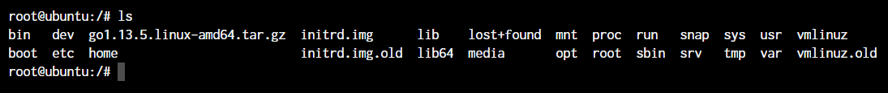
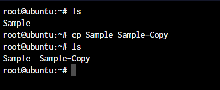
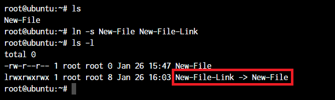

1. [**ls** - The most frequently used command in linux to list directories](image/ls-command-default.png)
1. [**pwd** - Print working directory command in linux](image/pwd-default-output.png)
1. [**cd** - Linux command to navigate through directories](image/cd-command-default.png)
1. [**mkdir** - Command used to create directories in linux](image/mkdir-default.png)
1. [**mv** - Move or rename files in Linux](image/mv-command-default.png)
1. [**cp** - Similar usage as mv but copying files in Linux](image/cp-command-default.png)
1. [**rm** - Delete files or directories](image/rm-default.png)
1. [**touch** - Create blank/empty files](image/touch-command-default.png)
1. [**ln** - Create symbolic links (shortcuts) to other files](image/symbolic-link-default.png)
1. **clear** - Clear terminal display
1. [**cat** - Display file contents on the terminal](image/cat-and-echo-commands.png)
1. **echo** - Print any text that follows the command
1. **less** - Linux command to display paged outputs in the terminal
1. **man** - Access manual pages for all linux commands
1. **uname** - Linux command to get basic information about the outputs
1. **whoami** - Get the active username
1. **tar** - Command to extract and compress files in linux
1. **grep** - Search for a string within an outputs
1. **head** - Return the specified number of lines from the top
1. **tail** - Return the specified number of lines from the bottom
1. **diff** - Find the difference between two files
1. **cmp** - Allows you to check if two files are identical
1. **comm** - Combines the functionality of diff and cmp
1. **sort** - Linux command to sort the content of a file while outputting
1. **export** - Export environment variables in Linux
1. **zip** - Zip files in Linux
1. **unzip** - Unzip files in Linux
1. **ssh** - Secure Shell command in Linux
1. **service** - Linux command to start and stop services
1. **ps** - Display active processes
1. **Kill and Killall** - Kill active processes by process ID or name
1. **df** - Display disk filesystem information
1. **mount** - Mount file systems in Linux
1. **chmod** - Command to change file permissions
1. **chown** - Command for granting ownership of files or folders
1. **ifconfig** - Display network interface and IP addresses
1. **traceroute** - Trace all the network interfaces and IP addresses hops to reach the destination
1. **wget** - Direct download files from the internet
1. **ufw** - Firewall command
1. **iptables** - Base firewall for all other firewall utilities to interface with
1. **apt, pacman, yum, rpm** -- Package managers depending on the distribution
1. **sudo** - Command to escalate privileges in Linux
1. **cal** - View a command-line calendar
1. **alias** - Create custom shortcuts for your regularly used commands
1. **dd** - Major;y used for creating bootable USB sticks
1. **whereis** - Locate the binary, source, and manual pages for a command
1. **whatis** - Find what a command is used for
1. **top** - View active processes live with their system usage
1. **useradd and usermod** - Add a new user or change existing user data
1. **passwd** - Create or update passwords for existing users

---
## The ```ls``` command in Linux



---
## The ```pwd``` command in Linux


Now, your terminal prompt should usually have the complete directory anyway. But in case it doesn’t, this can be a quick command to see the directory that you’re in. Another application of this command is when creating scripts where this command can allow us to find the directory where the script has been saved.

---
## The ```cd``` command in Linux
While working within the terminal, moving around within directories is pretty much a necessity. The cd command is one of the important Linux commands you must know, and it will help you navigate through directories. Just type ``cd`` followed by directory, as shown below.
```
root@ubuntu:~# cd <directory path>
```


---
## The ```mkdir``` command in Linux
```
root@ubuntu:~# mkdir <folder name>
```


---
## The ```cp``` and ```mv``` commands
The ``cp`` and ``mv`` commands are equivalent to the copy-paste and cut-paste commands in Windows. But since Linux doesn’t really have a command for renaming files, we also use the ``mv`` command to rename files and folders
```
root@ubuntu:~# cp <source> <destination>
```



In the above command, we created a copy of the file named Sample. Let's see what happens if we use the ``mv`` command in the same manner.

```
root@ubuntu:~# mv <source> <destination>
```


In the above case, since we were moving the file within the same directory, it acted as a rename. The file name is now changed.

---
## The ```rm``` command in Linux
In the previous section, we deleted the Sample-Copy file. The rm command is used to delete files and folders and is one of the important Linux commands you must know.

```
root@ubuntu:~# rm <file name>
```


To delete a directory, you must add the ``-r`` argument to it. Without the ``-r`` argument, the ``rm`` command won't delete directories.

```
root@ubuntu:~# rm -r <folder/directory name>
```
The -r flag in the ``rm`` command in Linux stands for **“recursive”**. When used with the ``rm`` command, it will remove not only the specified file but also all of its subdirectories and the files within those subdirectories recursively.

Note: It’s important to be careful when using the ``rm`` command with the ``-r`` flag, as it can quickly and permanently delete a large number of files and directories. It’s a good idea to use the ``-i`` flag in conjunction with the ``-r`` flag, which will prompt you for confirmation before deleting each file and directory.

For example, to remove the ``mydir`` directory and its contents with confirmation, you can use this command:

```
root@ubuntu:~# rm -ri mydir
```
This will prompt you for confirmation before deleting each file and directory within the ``mydir`` directory.

---
## The ```touch``` command in Linux
The ``touch`` command in Linux creates an empty file or updates the timestamp of an existing file.

```
root@ubuntu:~# touch <file name>
```


---
## The ```ln``` command in Linux
To create a link to another file, we use the ln command. This is one of the most important Linux commands that you should know if you’re planning to work as a Linux administrator.

```
root@ubuntu:~# ln -5 <source path> <link name>
```



The ``-s`` flag creates a symbolic link (also known as a symlink or soft link) to a file or directory. A symbolic link is a special type of file that acts as a shortcut or pointer to another file or directory.

By default, the ``ln`` command will make hard links instead of symbolic or soft links.

**Note**: Say you have a text file. If you make a **symbolic link** to that file, the link is only a pointer to the original file. If you delete the original file, the link will be broken, as it no longer has anything to point to.

A **hard link** is a mirror copy of an original file with the exact same contents. Like symbolic links, if you edit the contents of the original file, those changes will be reflected in the hard link. If you delete the original file, though, the hard link will still work, and you can view and edit it as you would a normal copy of the original file.

---
## The ```clear``` command in Linux
The ``clear`` command in Linux clears the terminal screen. It removes all the text and output currently displayed on the terminal and gives you a clean slate to work with.

Here is an example of how to use the ``clear`` command:

```
root@ubuntu:~# clear
```
This will list the files and directories in the current directory, and then clear the terminal screen.

**Note:** The ``clear`` command does not delete any files or data from your system. It only affects the display of the terminal.

---
## The ```cat```, ```echo```, and ```less``` commands
When you want to output the contents of a file or print anything to the terminal output, we use the ``cat`` or ``echo`` commands. Let’s see their basic usage.
```
root@ubuntu:~# cat <file name>
root@ubuntu:~# echo <Text to print on terminal>
```


As you can see in the above example, the ``cat`` command, when used on our ``New-File``, prints the contents of the file. At the same time, when we use ``echo`` command, it simply prints whatever follows after the command.

The ``less`` command is used when the output printed by any command is larger than the screen space and needs scrolling. The ``less`` command allows the user to break down the output and scroll through it with the use of the enter or space keys.

The simple way to do this is with the use of the pipe operator (``|``).

```
root@ubuntu:~# cat /boot/grub/grub.cfg | less
```
Note: Use the -S flag with less to enable line wrapping. This will allow you to view long lines of text without scrolling horizontally.

Use the -N flag with less to display line numbers. This can be useful when you need to know the line number of a specific piece of text.

You can use these useful flags in the following way:
```
root@ubuntu:~# cat /boot/grub/grub.cfg | less -sn
```
Using less with the pipe operator can be useful in many different situations. Here are a few examples:

Viewing the output of a long-running command, such as top or htop.
Searching for specific text in the output of a command, such as grep or cat .

---
