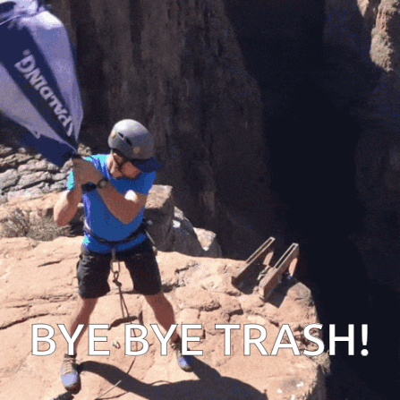

# 5 costly mistakes when deploying Docker containers (and how to dodge them like a pro 😎)

DOcker is a great tool for deploying web applications, but only if you use it the way it is intended. There's a lot of potential to shoot yourself in the foot🦶🏾. So if you want to save yourself from painful debugging hours, make sure you avoid these common mistakes.

## 1. Not Setting Resource Limits ❌
This one is especially important if you are running multi container setups on a single server. Greedy services can grab all the CPU or memory on your machine, leaving other containers with no resources to play with, or worse case: freeze the entire server.

Use the ```--cpu-quota``` and ```---memory``` flags to limit resource usage of containers at runtime.

```
docker run --memory="512" --cpu-quota=50000 your-image-name
```

You can find more information on these flags in the [official Docker documentation on resource constraints](https://docs.docker.com/config/containers/resource_constraints/)

If you can, avoid building your images on the same server where your containers run. Builds can take up a lot of CPU and memory, and if you don't account for it then your server will crash faster than you can say. "Please don't crash Mr. server! 😟'.

## 2. Not cleaning up ❌


No one likes to clean up, but it's a necessary task if you don't want to drown in your own 💩. Docker images can be huge - sometimes gigabytes in size. If you deploy new versions of your images and don't need the old ones anymore, you should get rid of them. Same goes for unused containers and volumes. They add up quickly and within no time your deployments fail, and you spend another 45 minutes trying to figure out that your disk is full...

Remove dangling (untagged, not in use)

Docker objects with:
```
docker container prune
docker image prune
docker volume prune
docker system prune # this removes all dangling images, volumes, and containers
```

Remove all unused Docker objects by adding ```-a```arg (also includes tagged images):
```
docker container prune -a
docker image prune -a
docker volume prune -a
docker system prune -a # this removes all unused dangling images, volumes, and containers
```

## 3. Leaking secrets in your images ❌


It's not uncommon for applications to require access to secrets at build time. What people don't realize is that an image, that is baked in secrets at build time need to be treated like a secret! A Docker image is not a vault. Everything that you put inside can be read by everyone who has access to the image. (Except if you'd do something wild and encrypt it😲). So never publish images on Docker Hub, if you baked secrets into them!

If you can avoid passing secrets at build time and rely on environment variables or use a secret manager. If it is not possible at all, make sure to only build the image in a trusted environment, keep it in a private registry, only move it through encrypted wires and prune it as soon as you don't need it anymore...

## 4. No Monitoring in place ❌
Containers are isolated and ephemeral, which is excellent for security and portability, but not ideal for monitoring.

Having to ```docker exec``` into your container every time you want to check the log file is a real pain, so make sure to come prepared ahead of time.

The easiest thing you can do to begin wit, is mount ahold your log files, so that they are at least persistent. But without log rotation and ideally some way to search through logs in place, this setup quickly reaches it's limits.

In order to get more visibility, you can implement log monitoring by streaming your data to an external system and also setting up resource monitoring tools to keep track of the CPU and memory usage across your containers.


## 5. Not optimizing Docker images ❌
As mentioned before, Docker images can be huge (up to several gigabytes in size). The last mistake I want to mention is not optimizing your Docker images. Not only does it save a ton of space, it also reduces the attack surface and makes your deployments a lot faster.

- use the smallest possible base image
- exclude unnecessary files in your .dockerignore file
- serve static assets from a CDN
- use multi stage builds